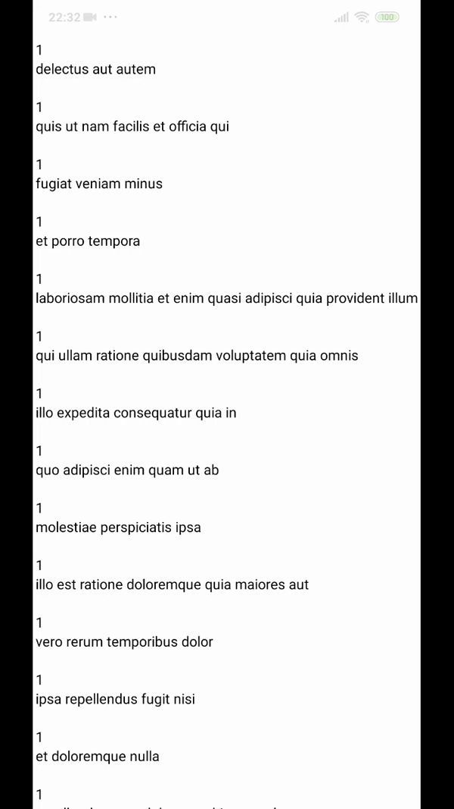

# rn-inifinitScroll-load

<p align="center">
  <a href="https://reactjs.org/">
    
  </a>
</p>

</h1>

<br/>

<br/>

<p align="center">
 
  </a>
  <a href="#">
    
  </a>
  <a href="https://github.com/arwysyah?tab=followers">
    
  </a>
  <a href="https://github.com/prettier/prettier"></a>

</p>

## BUILD SETUP

```bash

## Installation
Version 1.0.2

npm install rn-inifinitScroll-load --save


```

## USAGE

```js

import InfiniteScroll from rn-inifinitScroll-load

class App extends Component {
    state={
        active:0,
          itemRender: 9,
    increase: 5,
     data: [
      {
        userId: 1,
        id: 1,
        title: 'delectus aut autem',
        completed: false,
      },
      {
        userId: 1,
        id: 2,
        title: 'quis ut nam facilis et officia qui',
        completed: false,
      },
      {
        userId: 1,
        id: 3,
        title: 'fugiat veniam minus',
        completed: false,
      },
      {
        userId: 1,
        id: 4,
        title: 'et porro tempora',
        completed: true,
      },
      {
        userId: 1,
        id: 5,
        title:
          'laboriosam mollitia et enim quasi adipisci quia provident illum',
        completed: false,
      },
      {
        userId: 1,
        id: 6,
        title: 'qui ullam ratione quibusdam voluptatem quia omnis',
        completed: false,
      },
      {
        userId: 1,
        id: 7,
        title: 'illo expedita consequatur quia in',
        completed: false,
      },
      {
        userId: 1,
        id: 8,
        title: 'quo adipisci enim quam ut ab',
        completed: true,
      },
      {
        userId: 1,
        id: 9,
        title: 'molestiae perspiciatis ipsa',
        completed: false,
      },
      {
        userId: 1,
        id: 10,
        title: 'illo est ratione doloremque quia maiores aut',
        completed: true,
      },
      {
        userId: 1,
        id: 11,
        title: 'vero rerum temporibus dolor',
        completed: true,
      },
      {
        userId: 1,
        id: 12,
        title: 'ipsa repellendus fugit nisi',
        completed: true,
      },
      {
        userId: 1,
        id: 13,
        title: 'et doloremque nulla',
        completed: false,
      },
      {
        userId: 1,
        id: 14,
        title: 'repellendus sunt dolores architecto voluptatum',
        completed: true,
      },
      {
        userId: 1,
        id: 15,
        title: 'ab voluptatum amet voluptas',
        completed: true,
      },
      {
        userId: 1,
        id: 16,
        title: 'accusamus eos facilis sint et aut voluptatem',
        completed: true,
      },
      {
        userId: 1,
        id: 17,
        title: 'quo laboriosam deleniti aut qui',
        completed: true,
      },
      {
        userId: 1,
        id: 18,
        title: 'dolorum est consequatur ea mollitia in culpa',
        completed: false,
      },
      {
        userId: 1,
        id: 19,
        title: 'molestiae ipsa aut voluptatibus pariatur dolor nihil',
        completed: true,
      },
    }
booleanFunc = () => {
    this.setState({
      itemRender: this.state.itemRender + this.state.increase,

    });
  };
  renderItem = ({item, index}) => {
    if (index + 1 <= this.state.itemRender) {
      // console.log(item.views)

      return (
        <View>
          <Text>{item.userId}</Text>
          <Text>{item.title}</Text>
          <Text>{item.completed}</Text>
        </View>
      );
    }
  };
    render(){
       <View>
          <InfiniteScroll
            renderItem={this.renderItem}
            booleanFunc={this.booleanFunc}
            data={this.state.data}
            limit={this.state.itemRender}
            newIncrease={this.state.increase}
          />

        </View>


        )
    }
}
```


## Current API(Property)

| Property    | Type                     | Description                       |
| ----------- | ------------------------ | --------------------------------- |
| renderItem  | component                | render component                  |
| booleanFunc | PropTypes.function       | update state item                 |
| data        | PropTypes.Array of Objct | item that will be rendering       |
| limit       | PropTypes.number         | amount of item will display first |
| newIncrease | PropTypes.number         | amount of item that increase      |

## Project Documentation

<p align="center">
  
</p>

- Author Account

```bash
Arwy Syahputra Siregar
github.com/arwysyah

```

<p > Copyright ©</p> <p style="color:green;">by Arwy Syahputra Siregar</p>
